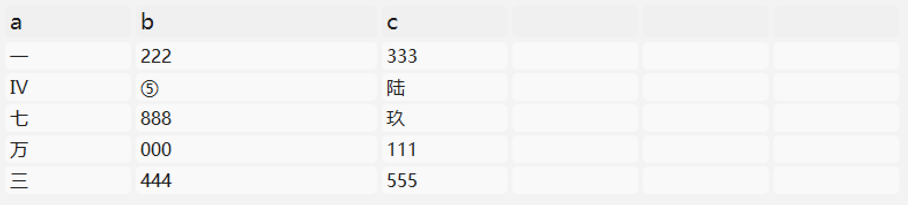
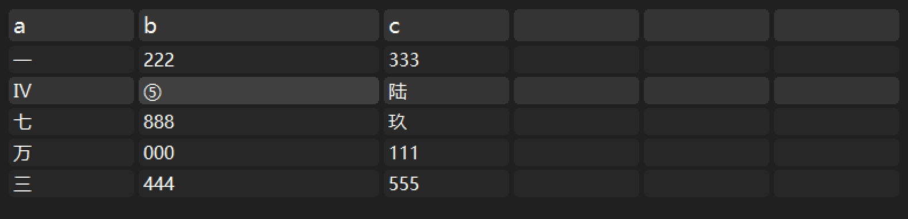

# TinUISheet

[TinUI](https://github.com/Smart-Space/TinUI)的高级表格控件。

> [!warning]
>
> TinUISheet已经可用于TinUI，但是当前仍处于早期开发状态。





---

# 使用

## TinUISheet类

```python
TinUISheet(
    ui:BasicTinUI, pos:tuple, width=300, height=300, minwidth=100, maxwidth=300,
    font=('微软雅黑', 12),
    fg='black', bg='white', itemfg='#1a1a1a', itembg='#f9f9f9', headbg='#f0f0f0',
    itemactivefg='#191919', itemactivebg='#f0f0f0',
    itemonfg='#191919', itemonbg='#e0e0e0',
    headfont=('微软雅黑', 14),
    anchor='nw'
)
```

- fg-文本颜色
- bg-表格背景色
- itemfg-数据文本颜色
- itembg-数据背景色
- headbg-表栏背景色
- itemactivefg-响应鼠标整行文本颜色
- itemactivebg-响应鼠标整行背景色
- itemonfg-选中时文本颜色
- itemonbg-选中时背景颜色

> [!note]
>
> 标准配色随时可能变动，建议自行指定颜色。
>
> `tinuisheet`提供`sheetlight`和`sheetdark`两种**样式配色**。

> [!tip]
>
> 通过`TinUISheet.uid`获取控件标识符，用于TinUI面板布局。
>
> TinSheet支持普通面板布局和拓展拉伸布局。当置于`ExpandPanel`中时，表格外框会平铺面板区域，表格本体的原点仍为表格框左上角。

**set_heads(heads)**

设置整个表头文本。

> 对于`heads`中的一项，如果为`dict`，则有如下结构：
>
> ```json
> {
>     'title': 'TITLE',
>     'width': WIDTH-INT // 宽度
> }
> ```

**set_head(index:int, head)**

设置某个表头文本。

> head可以为`str`，也可以同上为`dict`。

**append_content(content)**

加入一行数据。

**set_contents(index:int, contents:list)**

设置一行数据（从表头栏下一行开始记为`0`）。

**set_content(index:int, index2:int, content:str)**

设置`index`行`index2`列的数据。

**get_selected(specific=False)**

获取当前选中行中的所有文本列表，无则返回`None`。

当`specific`为`True`时，返回选中块的文本。

**delete_row(index:int)**

删除某行。

**delete_col(index:int)**

删除某列。

---

# 示例

```python
from tkinter import Tk
from tinui import BasicTinUI, ExpandPanel, HorizonPanel

def test(_):
    tus.delete_col(0)
    tus.delete_row(0)
    tus.set_head(0, {'title':'α', 'width':200})
    tus.set_head(1, 'bbb')
    for _ in range(30):
        tus.append_content(['三','444','555',' ',' '])
    pass

root = Tk()
root.geometry("400x400")

ui = BasicTinUI(root)
ui.pack(expand=True, fill='both')
tus = TinUISheet(ui, (15,15), **sheetlight)

tus.set_heads(['a',{'title':'b','width':200},'c',' ',' ',' '])
tus.append_content(['一','222','333',' ',' ',' '])
tus.append_content(['四','555','666',' ',' ',' '])
tus.append_content(['七','888','999',' ',' ',' '])
tus.append_content(['万','000','111',' ',' ',' '])
tus.append_content(['三','444','555',' ',' ',' '])
tus.set_contents(1, ['Ⅳ','⑤','陆',' ',' ',' '])
tus.set_content(2, 2, '玖')
ui.after(2000, lambda: print(tus.get_selected(True)))

rp = ExpandPanel(ui)
hp = HorizonPanel(ui, spacing=10)
rp.set_child(hp)

ep = ExpandPanel(ui)
hp.add_child(ep, weight=1)
ep.set_child(tus.uid)

hp.add_child(ui.add_button((10,350), text='test', command=test)[-1], 100)

def update(e):
    rp.update_layout(5,5,e.width-5,e.height-5)
ui.bind('<Configure>',update)

root.mainloop()
```

