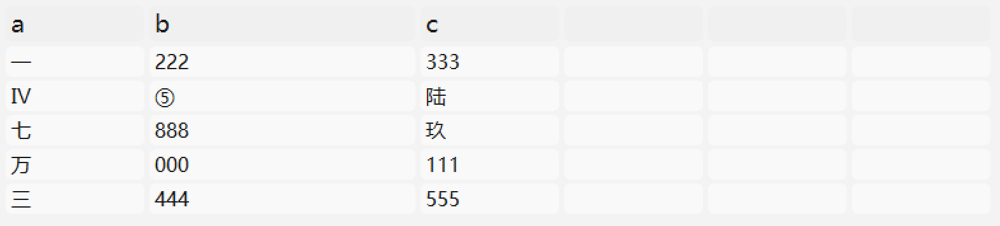
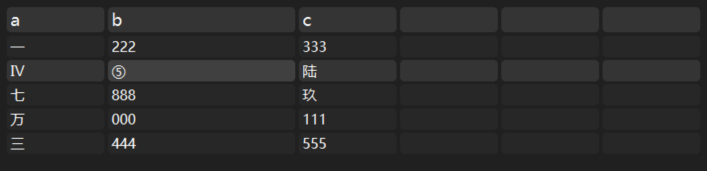
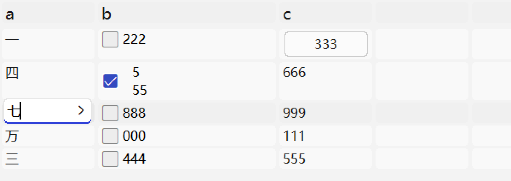

# TinUISheet

[TinUI](https://github.com/Smart-Space/TinUI)的高级表格控件。





---

# 使用

## TinUISheet类

```python
TinUISheet(
    ui:BasicTinUI, pos:tuple, width=300, height=300, minwidth=100, maxwidth=300,
    font=('微软雅黑', 12),
    fg='black', bg='white', itemfg='#1a1a1a', itembg='#f9f9f9', headbg='#f0f0f0',
    itemactivefg='#191919', itemactivebg='#f0f0f0',
    itemonfg='#191919', itemonbg='#e0e0e0',
    headfont=('微软雅黑', 14),
    anchor='nw'
)
```

- fg-文本颜色
- bg-表格背景色
- itemfg-数据文本颜色
- itembg-数据背景色
- headbg-表栏背景色
- itemactivefg-响应鼠标整行文本颜色
- itemactivebg-响应鼠标整行背景色
- itemonfg-选中时文本颜色
- itemonbg-选中时背景颜色

> [!note]
>
> 标准配色随时可能变动，建议自行指定颜色。
>
> `tinuisheet`提供`sheetlight`和`sheetdark`两种**样式配色**。

> [!tip]
>
> 通过`TinUISheet.uid`获取控件标识符，用于TinUI面板布局。
>
> TinSheet支持普通面板布局和拓展拉伸布局。当置于`ExpandPanel`中时，表格外框会平铺面板区域，表格本体的原点仍为表格框左上角。

#### set_heads(heads)

设置整个表头文本。

> 对于`heads`中的一项，如果为`dict`，则有如下结构：
>
> ```json
> {
>  'title': 'TITLE',
>  'width': WIDTH-INT // 宽度
> }
> ```

> [!important]
>
> 若表格文本超出一行，则整个表头背景均会匹配最长的一个表头内容。此后的修改，除非为空表格，均不会调整表头高度。作为表单数据显示控件，不建议内容中存在换行字符。

#### set_head(index:int, head)

设置某个表头文本。

> head可以为`str`，也可以同上为`dict`。

#### append_content(content)

加入一行数据。

> [!important]
>
> 若表格内容超出一行，则整行背景均会匹配最长的一个内容。单独设置一个或一行表格，均不会改变高度。作为表单数据显示控件，不建议内容中存在换行字符。

> `content`中的每一个元素，如果是字符串，则是常规文本，如果是字典，应当具备基本数据：`{'text':TEXT, 'type':TYPE, ...}`，`TYPE`如下：
>
> - `text`，普通文本
> - `check`，复选框。另外接收`command`回调函数（默认`None`）、`colors`配色（默认TinUI标准配色）、`val`初始值（默认`False`）
> - `button`，圆角按钮。另外接收`command`回调函数、`colors`配色
> - `edit`，可编辑内容。另外接收`command`回调函数（接收修改后文本）、`colors`配色

#### set_contents(index:int, contents:list)

设置一行数据（从表头栏下一行开始记为`0`）。

#### set_content(index:int, index2:int, content:str)

设置`index`行`index2`列的数据。

#### get_selected(specific=False)

获取当前选中行中的所有文本列表，无则返回`None`。

当`specific`为`True`时，返回选中块的文本。

#### get_selected_item()

获取当前选中的画布元素。

#### get_selected_row()

获取选择行的位置。

#### get_selected_col()

获取选择列的位置。

#### get_nearby_item(pos:tuple)

获取离`pos`最近的画布元素列表。为了方便使用，这里的`pos`应当是**控件坐标**，TinUISheet会自动将其转换为画布坐标。

#### delete_row(index:int)

删除某行。

> 无法删除表头。

#### delete_col(index:int)

删除某列。

#### delete_all()

删除所有行。

#### bind(sequence:str, func, add:bool=False)

TinUISheet的事件绑定方法，同tkinter一般控件。返回`funcid`。

#### unbind(sequence:str, funcid:int=None)

事件解绑。

---

# 示例

```python
from tkinter import Tk
from tinui import BasicTinUI, ExpandPanel, HorizonPanel

def test(_):
    tus.delete_col(0)
    tus.delete_row(0)
    tus.set_head(0, {'title':'α', 'width':200})
    tus.set_head(1, 'bbb')
    for _ in range(30):
        tus.append_content(['三','444','555',' ',' '])
    pass

root = Tk()
root.geometry("400x400")

ui = BasicTinUI(root)
ui.pack(expand=True, fill='both')
tus = TinUISheet(ui, (15,15), **sheetlight)

tus.set_heads(['a',{'title':'b','width':200},'c',' ',' ',' '])
	tus.append_content(['一',{'text':'222','type':'check'},{'text':'333', 'type':'button'},' ',' ',' '])
	tus.append_content(['四',{'text':'5\n55','type':'check','val':True},'666',' ',' ',' '])
	tus.append_content([{'text':'七','type':'edit','command':print},{'text':'888','type':'check'},'999',' ',' ',' '])
	tus.append_content(['万',{'text':'000','type':'check'},'111',' ',' ',' '])
	tus.append_content(['三',{'text':'444','type':'check'},'555',' ',' ',' '])
	tus.set_contents(1, ['Ⅳ',{'text':'⑤','type':'check'},'陆',' ',' ',' '])
tus.set_content(2, 2, '玖')
ui.after(2000, lambda: print(tus.get_selected(True)))

rp = ExpandPanel(ui)
hp = HorizonPanel(ui, spacing=10)
rp.set_child(hp)

ep = ExpandPanel(ui)
hp.add_child(ep, weight=1)
ep.set_child(tus.uid)

hp.add_child(ui.add_button((10,350), text='test', command=test)[-1], 100)

def update(e):
    rp.update_layout(5,5,e.width-5,e.height-5)
ui.bind('<Configure>',update)

root.mainloop()
```



> 若要使用更高级的tkinter表格功能，可以使用`tksheet`库。从`add_ui`获取画布控件，再将`Sheet`控件`pack(fill='both',expand=True)`即可，这样可以由TinUI负责`Sheet`的布局。
